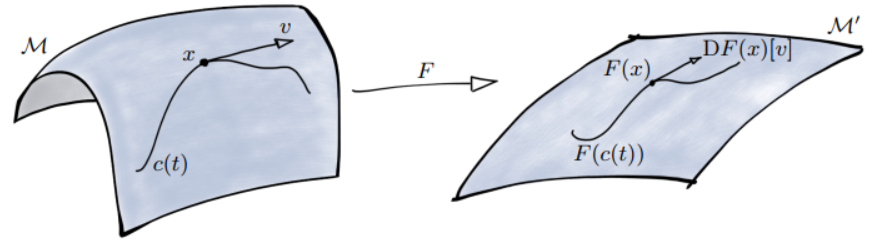

- Title: Cheat Sheet of Optiomization on Manifold
- Last revised: 18/10/2023
- Reference Book: Boumal, N. (2023). An introduction to optimization on smooth manifolds.

---

- (**Smooth Embedded Submanifold of A Linear Space** [Def. 3.10]) Let $\mathcal{E}$ be a linear space of dimension $d$. A non-empty subset $\mathcal{M}$ is a (smooth) embedded submanifold of $\mathcal{E}$of dimension $n$ if either
  1. $n=d$ and $\mathcal{M}$ is open in $\mathcal{E}$ - we also call this an *open submanifold*; or
  2. $n=d-k$ for some $k\geq1$ and, for each $x\in\mathcal{M}$, there exists a neighborhood $U$ of $x$in $\mathcal{E}$ and a smooth function $h:U\rightarrow\mathbb{R}^k$ such that 
     1. If $y$ is in $U$, then $h(y)=0$ if and only if $y\in\mathcal{M}$; and 
     2. $\mathrm{rank\ D}h(x)=k$.  
  
  Such a function $h$ is called a *local defining function* for $\mathcal{M}$ at $x$.

  If $M$ is a linear (sub)space, we also call it a linear manifold.

  **Example - Unit Sphere:** $\mathbb{S}^{d}=\mathbb{S}^{n-1}=\{x\in\mathbb{R}^n\ \vert\ x^Tx-1\}$. The local defining function is $h(x)=x^Tx-1$. The differential at direction $v$ is $\mathrm{D}h(x)[v]=\lim_{t\rightarrow0}\frac{(x+tv)^T(x+tv)-1-x^Tx+1}{t}=\lim_{t\rightarrow0}\frac{x^Tx+tx^Tv+tv^Tx+t^2v^Tv-x^Tx}{t}=2v^Tx$. Therefore, the differential is $\mathrm{D}h(x)=2x$.

- (**Diffeomorphism** [Def. 3.11]) A *diffeomorphism* is a bijective map $F:U\rightarrow V$, where $U,V$ are open sets and such that both $F$ and $F^{-1}$ are smooth.

- (**Tangent Space** [Def. 3.14]) Let $\mathcal{M}$ be a subset of $\mathcal{E}$. For all $x\in\mathcal{M}$, define:

  $$\mathrm{T}_x\mathcal{M}=\{c^\prime(0)\ \vert\ c:I\rightarrow\mathcal{M}\text{ is smooth and }c(0)=x\},$$

  where $I$ is any open interval containing $t=0$. That is, $v$ is in $\mathrm{T}_x\mathcal{M}$ if and only if there exists a smooth curve on $\mathcal{M}$ passing through $x$ with velocity $v$.

  - (**Tangent Space is the Kernel of Differential** [Theorem 3.15]) Let $\mathcal{M}$ be an embedded submanifold of $\mathcal{E}$. Consider $x\in\mathcal{M}$ and the set $\mathrm{T}_x\mathcal{M}$. If $\mathcal{M}$ is an open submanifold, then $\mathrm{T}_x\mathcal{M}=\mathcal{E}$. Otherwise, $\mathrm{T}_x\mathcal{M}=\text{ker}\mathrm{D}h(x)$ with $h$ any local defining function at $x$.

  - (**Tangent Space & Tangent Vectors** [Def. 3.16]) We call $\mathrm{T}_x\mathcal{M}$ the *tangent space* to $\mathcal{M}$ at $x$. Vectors in $\mathrm{T}_x\mathcal{M}$ are called *tangent vectors* to $\mathcal{M}$ at $x$. The dimension of $\mathrm{T}_x\mathcal{M}$ (which is independent of $x$) coincides with the dimension of $\mathcal{M}$, denoted by $\mathrm{dim}\mathcal{M}$.
  
  - (**Product Manifold** [Prop. 3.20]) Let $\mathcal{M},\mathcal{M}^\prime$ be embedded submanifolds of $\mathcal{E},\mathcal{E}^\prime$ (respectively). Then, $\mathcal{M}\times\mathcal{M}^\prime$ is an embedded submanifold of $\mathcal{E}\times\mathcal{E}^\prime$ of dimension $\mathrm{dim}\mathcal{M}+\mathrm{dim}\mathcal{M}^\prime$ with tangent spaces given by $\mathrm{T}_{x,x^\prime}(\mathcal{M}\times\mathcal{M}^\prime)=\mathrm{T}_x\mathcal{M}\times\mathrm{T}_{x^\prime}\mathcal{M}^\prime$.

  **Example - Tangent space of unit sphere $\mathbb{S}^d$**: $\mathrm{T}_x\mathbb{S}^d$ is the kernel of $\mathrm{D}h(x)[v]=2v^Tx=0$, which means $\mathrm{T}_x\mathbb{S}^d=\{v\ \vert\ v^Tx=0\}$. In other words, the tangent space is the one where all the vectors orthogonal to $x$.

- (**Subspace Topology** [Def. 3.21])

- (**Neighborhood** [Def. 3.22])

- (**Local Smooth Extension** [Def. 3.30])

- (**Scalar Field**) A *scalar field* on a manifold $\mathcal{M}$ is a function $f:\mathcal{M}\rightarrow\mathbb{R}$. If $f$ is a smooth function, we say it is a smooth scalar field. The set of smooth scalar fields on $\mathcal{M}$ is denoted by $\mathfrak{F}(\mathcal{M})$.

- (**Differential of Mapping**)
  
  - (**Between Linear Spaces**) Let $\bar{F}:U\in\mathcal{E}\rightarrow\mathcal{E}^\prime$ be a smooth function between two linear spaces, possibly restricted to an open set $U$. The differential of $\bar{F}$ at $x\in U$ is a linear map $\mathrm{D}\bar{F}(x):\mathcal{E}\rightarrow\mathcal{E}^\prime$ defined by

    $$\mathrm{D}\bar{F}(x)[v]=\lim_{t\rightarrow0}\frac{\bar{F}(x+tv)-\bar{F}(x)}{t}.$$

    **Example**: Let $f(x)=x^TAx$ where $A\in\mathrm{Sym}(d)$ is a $d$-by-$d$ symmetric matrix, and $x\in\mathbb{R}^{d}$. The differential is

  $$\begin{aligned}\mathrm{D}\bar{f}(x)[v]=\ &\lim_{t\rightarrow0}\frac{\bar{f}(x+tv)-\bar{f}(x)}{t}\\=&\lim_{t\rightarrow0}\frac{(x+tv)^TA(x+tv)-x^TAx}{t}\\=&x^TAv+v^TAx\\=&x^T(A+A^T)v=2x^TAv.\end{aligned}$$

  - (**Between Manifolds** [Def. 3.34]) The *differential* of $F:\mathcal{M}\rightarrow\mathcal{M}^\prime$ at the point $x\in\mathcal{M}$ is the linear map $\mathrm{D}F(x):\mathrm{T}_x\mathcal{M}\rightarrow\mathrm{T}_{F(x)}\mathcal{M}^\prime$ defined by

    $$\mathrm{D}F(x)[v]=\left.\frac{\mathrm{d}}{\mathrm{d}t}F(c(t))\right\lvert_{t=0}=(F\circ c)^\prime(0),$$

    where $c$ is a smooth curve on $\mathcal{M}$ passing through $x$ at $t=0$ with velocity $v$.

    **Note**: (a) Linear space is also a manifold. Therefore, in some aspect a mapping between linear spaces can be viewed as a special case of a mapping between manifolds. (b) Applying the definition of mapping between linear spaces to a mapping between manifolds can be problematic, because the $x+tv$ generally does not belong to $\mathcal{M}$. (c) Relying on Def. 3.14, $t\mapsto x+tv$ is nothing but a curve in $\mathcal{E}$ which passes through $x$ with velocity $v$. (d) Relying on Def. 3.30, we can smoothly extend $F$ and differentiate the extension instead.

    

    (*Figure 3.3* A smooth map $F:\mathcal{M}\rightarrow\mathcal{M}^\prime$ pushes curves $c$ on $\mathcal{M}$ to smooth curves $F\circ c$ on $\mathcal{M}^\prime$)

  - For smooth maps $F_1,F_2:\mathcal{M}\rightarrow\mathcal{E}^\prime$ and real numbers $a_1,a_2$, then $F:x\mapsto a_1F_1(x)+a_2F_2{x}$ is smooth and we have linearity $\mathrm{D}F(x)=a_1\mathrm{D}F_1(x)+a_2\mathrm{D}F_2{x}$.

- (**Riemannian Gradient** & **Riemannian Metric** [Def. 3.58]) Let $f:\mathcal{M}\rightarrow\mathbb{R}$ be smooth on a Riemannian manifold $\mathcal{M}$. The *Riemannian gradient* of $f$ is the vector field $\mathrm{grad}f$ on $\mathcal{M}$ uniquely defined by the following identities:

  $$\forall(x,v)\in\mathrm{T}\mathcal{M},\qquad\mathrm{D}f(x)[v]=\langle v,\mathrm{grad}f(x)\rangle_x,$$

  where $\mathrm{D}f(x)$ is as in Definition 3.34 and $\langle\cdot,\cdot\rangle_x$ is the *Riemannian metric*.

  **3 Ways to Compute Riemannian Gradient**:

   1. (**From the definition**)
   2. (**Through a retraction** [Prop. 3.59]) Let $f:\mathcal{M}\rightarrow\mathbb{R}$ be a smooth function on a Riemannian manifold $\mathcal{M}$ equipped with a retraction $\mathrm{R}$. Then, for all $x\in\mathcal{M}$, $\mathrm{grad}f(x)=\mathrm{grad}(f\circ\mathrm{R}_x)(0)$, where $f\circ\mathrm{R}_x:\mathrm{T}_x\mathcal{M}\rightarrow\mathbb{R}$ is defined on a Euclidean space (the linear space $\mathrm{T}_x\mathcal{M}$ with inner product $\langle\cdot,\cdot\rangle_x$), hence its gradient is a "classical gradient".
   3. (**Via a smooth extension** (especially good for Riemannian submanifolds)) (1) Obtain a smooth extension of $f:U\rightarrow\mathbb{R}$, denoted as $\bar{f}$. (b) Compute $\mathrm{grad}\bar{f}(x)$. Note that $\mathrm{grad}\bar{f}(x)$ is in $\mathcal{E}$ instead of $\mathrm{T}_x\mathcal{M}$. (c) Project $\mathrm{grad}\bar{f}(x)$ back on the tangent space $\mathrm{T}_x\mathcal{M}$, leading to $\mathrm{grad}f(x)$.

- (**Orthogonal Projector** [Def. 3.60]) Let $\mathcal{M}$ be an embedded submanifold of a Euclidean space $\mathcal{E}$ equipped with a Euclidean metric $\langle\cdot,\cdot\rangle$. The *orthogonal projector* to $\mathrm{T}_x\mathcal{M}$ is the linear map $\mathrm{Proj}_x:\mathcal{E}\rightarrow\mathcal{E}$ characterized by the following properties:

  1. Range: $\mathrm{im}(\mathrm{Proj}_x)=\mathrm{T}_x\mathcal{M}$;
  2. Projector: $\mathrm{Proj}_x\circ\mathrm{Proj}_x=\mathrm{Proj}_x$;
  3. Orthogonal: $\langle u-\mathrm{Proj}_x(u),v\rangle=0$ for all $v\in\mathrm{T}_x\mathcal{M}$ and $u\in\mathcal{E}$.

  **Example - Orthogonal projector for unit sphere**: We know the tangent space $\mathrm{T}_x\mathbb{S}^{n-1}=\{v\ \vert\ v^Tx=0\}$. Since the tangent space is a subspace of vector space $\mathcal{E}$, any vector $u\in\mathcal{E}$ can be decomposed into two parts - one is on the tangent space and the other is orthogonal to the tangent space, i.e. $u=u_{\|}+u_{\perp}$, where $\mathrm{Proj}_x(u)=u_{\|}$ is the orthogonal projection onto $\mathrm{T}_x\mathbb{S}^{n-1}$. Note that $x$ is also orthogonal to the tangent space. It shows the fact that $u_{\perp}$ is parallel to $x$. As a result, we need only project $u$ on $x$ and then subtract it from $u$ itself, the remaining part is $u_{\|}$, the orthogonal projection of $u$ on the tangent space. We know that $u_{\perp}=\frac{u^Tx}{x^Tx}x=u^Txx$, since $x\in\mathbb{S}^{n-1}$, i.e., $x^Tx=1$. Eventually, we obtain $\mathrm{Proj}_x(u)=u-u^Txx=u-xx^Tu=(I-xx^T)u$, resulting in the orthogonal projector for the unit sphere $\mathrm{Proj}_x=I-xx^T$.